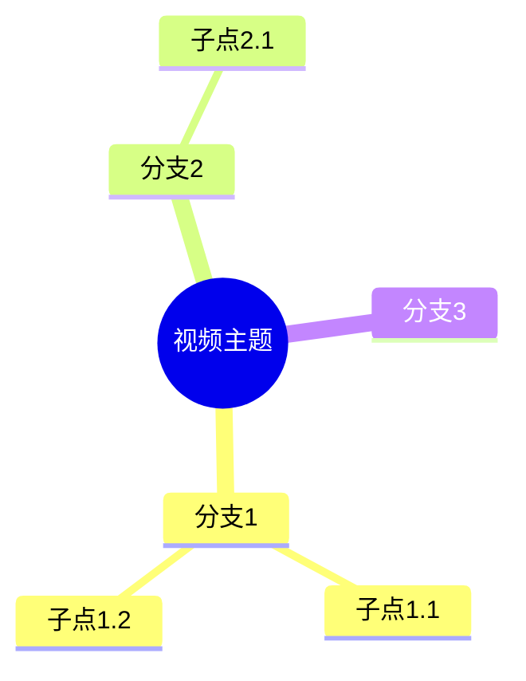

# v1.4 设计方案：扩展内容输出能力

**创建时间：** 2026-05-05
**版本：** v1.4
**目标：** 扩展内容输出能力，新增思维导图、视频脚本、多平台文案、SEO文章四种输出格式

## 一、功能概述

v1.4 版本专注于扩展内容输出能力，新增4种输出格式：
1. **思维导图**（基础版 - A1）
2. **视频脚本**（进阶版 - A2）
3. **社交媒体多平台文案**（进阶版 - B2）
4. **SEO文章**（高级版 - C3）

采用渐进式实现方案，分4个Phase完成。

## 二、功能模块设计

### 2.1 思维导图输出

**复杂度：** A1（基础版）

**功能描述：**
基于视频内容生成三层结构的思维导图：中心主题 → 主要分支（3-5个）→ 子分支（每个主要分支2-4个）。

**技术实现：**
- 作为新的输出类型 `mindmap`
- 使用 Mermaid 语法渲染思维导图
- 基于总结内容提取层级结构
- 使用 Mermaid.js 在前端渲染

**输出格式示例：**


**UI呈现：**
- 在结果页面的标签栏中添加"思维导图"标签
- 支持复制 Mermaid 代码
- 支持导出为图片（使用 mermaid-cli）

### 2.2 视频脚本输出

**复杂度：** A2（进阶版）

**功能描述：**
生成视频脚本，支持不同类型和时长配置。

**支持的脚本类型：**
- 口播类（如知识科普）
- 解说类（如影视解说）
- 剧情类（如短剧）

**可配置参数：**
- 脚本类型（口播/解说/剧情）
- 目标时长（30秒/60秒/3分钟/5分钟）
- 语言风格（专业/轻松/幽默）

**技术实现：**
- 作为新的输出类型 `script`
- 基于文章和总结内容生成脚本
- 前端提供配置界面（在生成前选择）
- 脚本格式：分场景、分镜头

**输出格式示例：**
```
【场景1】开场 - 时长：10秒
镜头：特写主持人
字幕：大家好，今天我们来聊...

【场景2】引入主题 - 时长：15秒
镜头：切换到相关画面
旁白：你有没有想过...

【场景3】主体内容 - 时长：30秒
...
```

**UI呈现：**
- 在结果页面的标签栏中添加"视频脚本"标签
- 支持重新生成时修改参数

### 2.3 社交媒体多平台文案

**复杂度：** B2（进阶版）

**功能描述：**
为8-10个主流平台生成适配的文案，每个平台独立配置。

**支持的平台：**
- 抖音、快手（短视频平台）
- 小红书（种草平台）
- 微博（社交媒体）
- 知乎（问答平台）
- B站（视频平台）
- 微信公众号（长文平台）
- 头条号（资讯平台）
- 百家号（百度生态）

**可配置参数：**
- 选择要生成的平台（多选）
- 每个平台的文案风格（专业/轻松/幽默/情感/吐槽等）
- 每个平台的目标字数范围

**技术实现：**
- 创建独立配置页面 `/social-config`
- 创建独立输出页面 `/social-output`
- 作为后处理步骤，基于总结/文章生成多平台文案
- 新增实体：SocialPlatformConfig、SocialOutput

**输出格式：**
每个平台一条独立文案，包含：
- 平台名称
- 文案内容
- 建议标签
- 字数统计

**UI设计：**
- 配置页面：表格形式，每行一个平台，可配置风格和字数
- 输出页面：卡片式展示，每个平台一张卡片

### 2.4 SEO文章输出

**复杂度：** C3（高级版）

**功能描述：**
生成经过完整SEO优化的文章，包含关键词优化、结构优化、内链建议等。

**可配置参数：**
- 主关键词（必填）
- 长尾关键词列表（选填）
- 关键词密度（1%-3%）
- 文章长度（800/1500/2000字）
- H标签结构（自动生成/自定义）
- 是否生成内链建议
- 是否进行竞品分析
- 可读性评分

**技术实现：**
- 创建独立配置页面 `/seo-config`
- 创建独立输出页面 `/seo-output`
- 作为后处理步骤，基于文章内容进行SEO优化
- 新增实体：SEOConfig、SEOOutput、KeywordAnalysis

**输出格式：**
```markdown
# SEO优化文章

**SEO元信息：**
- 标题：[H1] 主标题（含主关键词）
- 描述：[meta description] 150-160字
- 关键词：主关键词 + 长尾关键词列表

**关键词密度分析：**
- 主关键词：出现X次，密度Y%
- 长尾关键词1：出现X次

**H标签结构：**
H1: 主标题
H2: 主要观点1
H3: 次级观点1.1
...

**内链建议：**
1. 建议锚文本1 → 链接URL
2. 建议锚文本2 → 链接URL

**竞品分析：**
- 相关内容排名TOP3的文章摘要
- 差异化建议

**可读性评分：** 85/100（良好）

**完整文章内容：**
[文章正文...]
```

**UI设计：**
- 配置页面：表单式布局，分组展示不同配置项
- 输出页面：左右分栏，左侧SEO分析，右侧完整文章

## 三、数据库设计

### 3.1 平台配置表（social_platform_config）

```sql
CREATE TABLE social_platform_config (
    id BIGINT AUTO_INCREMENT PRIMARY KEY,
    user_id BIGINT NOT NULL COMMENT '用户ID',
    platform VARCHAR(50) NOT NULL COMMENT '平台名称：douyin/xiaohongshu/weibo/zhihu/bilibili/wechat/toutiao/baijiahao',
    enabled BOOLEAN DEFAULT TRUE COMMENT '是否启用',
    style VARCHAR(20) NOT NULL DEFAULT 'professional' COMMENT '文案风格',
    min_length INT DEFAULT 100 COMMENT '最小字数',
    max_length INT DEFAULT 500 COMMENT '最大字数',
    tags TEXT COMMENT '建议标签（JSON数组）',
    created_at DATETIME NOT NULL DEFAULT CURRENT_TIMESTAMP,
    updated_at DATETIME NOT NULL DEFAULT CURRENT_TIMESTAMP ON UPDATE CURRENT_TIMESTAMP,
    UNIQUE KEY uk_user_platform (user_id, platform),
    INDEX idx_user_id (user_id)
) ENGINE=InnoDB DEFAULT CHARSET=utf8mb4;
```

### 3.2 多平台文案输出表（social_output）

```sql
CREATE TABLE social_output (
    id BIGINT AUTO_INCREMENT PRIMARY KEY,
    task_id BIGINT NOT NULL COMMENT '关联的任务ID',
    user_id BIGINT NOT NULL COMMENT '用户ID',
    platform VARCHAR(50) NOT NULL COMMENT '平台名称',
    content TEXT NOT NULL COMMENT '文案内容',
    tags JSON COMMENT '标签列表',
    style VARCHAR(20) COMMENT '使用的风格',
    character_count INT COMMENT '字数统计',
    created_at DATETIME NOT NULL DEFAULT CURRENT_TIMESTAMP,
    INDEX idx_task_id (task_id),
    INDEX idx_user_id (user_id),
    INDEX idx_platform (platform)
) ENGINE=InnoDB DEFAULT CHARSET=utf8mb4;
```

### 3.3 SEO配置表（seo_config）

```sql
CREATE TABLE seo_config (
    id BIGINT AUTO_INCREMENT PRIMARY KEY,
    user_id BIGINT NOT NULL COMMENT '用户ID',
    name VARCHAR(200) NOT NULL COMMENT '配置名称',
    primary_keyword VARCHAR(200) NOT NULL COMMENT '主关键词',
    long_tail_keywords JSON COMMENT '长尾关键词列表',
    keyword_density DECIMAL(3,2) DEFAULT 0.02 COMMENT '关键词密度（0.01-0.03）',
    target_length INT DEFAULT 1500 COMMENT '目标字数',
    heading_structure VARCHAR(20) DEFAULT 'auto' COMMENT 'H标签结构：auto/custom',
    enable_internal_links BOOLEAN DEFAULT TRUE COMMENT '是否生成内链建议',
    enable_competitor_analysis BOOLEAN DEFAULT TRUE COMMENT '是否进行竞品分析',
    enable_readability_score BOOLEAN DEFAULT TRUE COMMENT '是否生成可读性评分',
    created_at DATETIME NOT NULL DEFAULT CURRENT_TIMESTAMP,
    updated_at DATETIME NOT NULL DEFAULT CURRENT_TIMESTAMP ON UPDATE CURRENT_TIMESTAMP,
    INDEX idx_user_id (user_id)
) ENGINE=InnoDB DEFAULT CHARSET=utf8mb4;
```

### 3.4 SEO输出表（seo_output）

```sql
CREATE TABLE seo_output (
    id BIGINT AUTO_INCREMENT PRIMARY KEY,
    task_id BIGINT NOT NULL COMMENT '关联的任务ID',
    user_id BIGINT NOT NULL COMMENT '用户ID',
    config_id BIGINT COMMENT '使用的SEO配置ID',
    title VARCHAR(300) NOT NULL COMMENT '优化后的标题（H1）',
    description VARCHAR(500) COMMENT 'Meta描述',
    keywords TEXT COMMENT '关键词列表',
    heading_structure JSON COMMENT 'H标签结构',
    keyword_analysis JSON COMMENT '关键词密度分析',
    internal_links JSON COMMENT '内链建议',
    competitor_analysis JSON COMMENT '竞品分析',
    readability_score INT COMMENT '可读性评分（0-100）',
    optimized_content LONGTEXT NOT NULL COMMENT '优化后的完整文章',
    created_at DATETIME NOT NULL DEFAULT CURRENT_TIMESTAMP,
    INDEX idx_task_id (task_id),
    INDEX idx_user_id (user_id),
    INDEX idx_config_id (config_id)
) ENGINE=InnoDB DEFAULT CHARSET=utf8mb4;
```

### 3.5 关键词分析表（keyword_analysis）

```sql
CREATE TABLE keyword_analysis (
    id BIGINT AUTO_INCREMENT PRIMARY KEY,
    task_id BIGINT NOT NULL,
    user_id BIGINT NOT NULL,
    keyword VARCHAR(200) NOT NULL COMMENT '关键词',
    keyword_type VARCHAR(20) NOT NULL COMMENT '类型：primary/long_tail',
    count INT DEFAULT 0 COMMENT '出现次数',
    density DECIMAL(5,2) COMMENT '密度百分比',
    position_json JSON COMMENT '出现位置列表',
    created_at DATETIME NOT NULL DEFAULT CURRENT_TIMESTAMP,
    INDEX idx_task_id (task_id),
    INDEX idx_keyword (keyword)
) ENGINE=InnoDB DEFAULT CHARSET=utf8mb4;
```

## 四、技术架构

### 4.1 前端架构

#### 4.1.1 新增路由

```typescript
// router/index.ts
{
  path: '/social-config',
  name: 'social-config',
  component: () => import('../views/SocialConfigView.vue')
},
{
  path: '/seo-config',
  name: 'seo-config',
  component: () => import('../views/SeoConfigView.vue')
},
{
  path: '/social-output/:taskId',
  name: 'social-output',
  component: () => import('../views/SocialOutputView.vue')
},
{
  path: '/seo-output/:taskId',
  name: 'seo-output',
  component: () => import('../views/SeoOutputView.vue')
}
```

#### 4.1.2 新增组件

- `MindmapRenderer.vue` - 思维导图渲染组件（使用 mermaid）
- `ScriptViewer.vue` - 视频脚本查看组件
- `SocialConfigForm.vue` - 多平台配置表单
- `SeoConfigForm.vue` - SEO配置表单
- `SocialOutputCard.vue` - 单个平台文案卡片
- `SeoAnalysisPanel.vue` - SEO分析面板

#### 4.1.3 修改现有页面

- `TaskResultView.vue` - 添加"思维导图"和"视频脚本"标签
- `SubmitView.vue` - 添加"生成多平台文案"和"生成SEO文章"按钮（在结果展示后）

### 4.2 后端架构

#### 4.2.1 Service层扩展

```
TaskService (现有)
├── processTask() - 处理单个视频
└── 新增方法：
    ├── generateMindmap() - 生成思维导图
    ├── generateScript() - 生成视频脚本
    └── generateSocialAndSeo() - 生成多平台文案和SEO文章（后处理）

SocialPlatformConfigService (新增)
├── getByUserId() - 获取用户平台配置
├── create() - 创建配置
├── update() - 更新配置
└── delete() - 删除配置

SeoConfigService (新增)
├── getByUserId() - 获取用户SEO配置
├── create() - 创建配置
├── update() - 更新配置
└── delete() - 删除配置

KeywordAnalysisService (新增)
├── analyze() - 分析关键词密度
├── calculateDensity() - 计算密度
└── findPositions() - 查找关键词位置
```

#### 4.2.2 Controller层扩展

```
VideoController (现有)
└── 新增接口：
    ├── GET /{taskId}/mindmap - 获取思维导图
    ├── GET /{taskId}/script - 获取视频脚本
    ├── POST /{taskId}/social - 生成多平台文案
    ├── POST /{taskId}/seo - 生成SEO文章
    ├── GET /{taskId}/social - 获取多平台文案结果
    └── GET /{taskId}/seo - 获取SEO文章结果

SocialConfigController (新增)
├── GET /api/social-config - 获取用户平台配置
├── POST /api/social-config - 创建配置
├── PUT /api/social-config/{id} - 更新配置
└── DELETE /api/social-config/{id} - 删除配置

SeoConfigController (新增)
├── GET /api/seo-config - 获取用户SEO配置
├── POST /api/seo-config - 创建配置
├── PUT /api/seo-config/{id} - 更新配置
└── DELETE /api/seo-config/{id} - 删除配置
```

#### 4.2.3 Pipeline集成

**现有Pipeline：**
```
extract (提取字幕) → summary (生成总结) → article (生成文章) → card/xiaohongshu (并行)
```

**后处理Pipeline（新增）：**
```
基于summary和article → [并行]
                     ├── mindmap (生成思维导图)
                     ├── script (生成视频脚本)
                     ├── social (生成多平台文案)
                     └── seo (生成SEO文章)
```

## 五、实现Phase划分

### Phase 1：基础输出格式（思维导图 + 视频脚本）

**目标：** 在现有框架上快速添加两个新的输出类型

**预计周期：** 3-5天

#### 5.1.1 后端任务

**Task 1.1：扩展TaskResult实体**
- 文件：`TaskResult.java`
- 修改：在 OutputType 枚举中添加 `MINDMAP` 和 `SCRIPT`

**Task 1.2：修改Pipeline处理逻辑**
- 文件：`TaskService.java`
- 修改：`processTask()` 方法，添加新的输出类型处理

**Task 1.3：添加获取接口**
- 文件：`VideoController.java`
- 添加：`GET /{taskId}/mindmap` 和 `GET /{taskId}/script`

#### 5.1.2 前端任务

**Task 1.4：扩展标签页**
- 文件：`TaskResultView.vue`
- 修改：`tabLabels` 对象，添加 `mindmap` 和 `script`

**Task 1.5：创建思维导图渲染组件**
- 文件：`components/MindmapRenderer.vue`

**Task 1.6：创建视频脚本查看组件**
- 文件：`components/ScriptViewer.vue`

**Task 1.7：集成到TaskResultView**
- 文件：`TaskResultView.vue`

#### 5.1.3 验收标准

- [ ] 任务结果页面显示"思维导图"和"视频脚本"标签
- [ ] 思维导图可正常渲染，支持复制代码
- [ ] 视频脚本按场景分卡片显示
- [ ] 支持重新生成这两个输出类型

---

### Phase 2：多平台文案和SEO文章后处理

**目标：** 实现后处理逻辑，能够基于现有内容生成新格式

**预计周期：** 5-7天

#### 5.2.1 后端任务

**Task 2.1：创建数据库表**
- 执行 SQL：创建 5 张新表

**Task 2.2-2.3：创建实体类和Mapper接口**
- 5个实体类
- 5个Mapper接口

**Task 2.4：创建Service层**
- SocialPlatformConfigService
- SeoConfigService
- KeywordAnalysisService
- 扩展 TaskService

**Task 2.5：创建Controller层**
- SocialConfigController
- SeoConfigController
- 扩展 VideoController

#### 5.2.2 前端任务

**Task 2.6：创建API模块**
- `api/social.ts`
- `api/seo.ts`

**Task 2.7：创建基础页面**
- `views/SocialOutputView.vue`
- `views/SeoOutputView.vue`

**Task 2.8-2.9：添加入口**
- SubmitView 和 TaskResultView 添加生成按钮

#### 5.2.3 验收标准

- [ ] 可生成多平台文案，每个平台独立显示
- [ ] 可生成SEO文章，包含完整的SEO分析
- [ ] 前端页面能正常展示结果
- [ ] 支持重新生成

---

### Phase 3：独立配置页面

**目标：** 创建配置页面，让用户可以自定义参数

**预计周期：** 4-6天

#### 5.3.1 后端任务

**Task 3.1：完善Service层**
- 完善 CRUD 逻辑
- 添加配置验证

**Task 3.2：添加默认配置**
- `resources/default_configs.sql`

#### 5.3.2 前端任务

**Task 3.3：创建SocialConfigView页面**

**Task 3.4：创建SeoConfigView页面**

**Task 3.5-3.6：完善生成流程**
- SubmitView 添加配置选择
- TaskResultView 添加配置选择

**Task 3.7：更新导航栏**
- App.vue 添加配置页面链接

#### 5.3.3 验收标准

- [ ] 可访问配置页面
- [ ] 可创建、编辑、删除配置
- [ ] 生成时可以选择配置
- [ ] 新用户有默认配置

---

### Phase 4：优化和增强

**目标：** 根据用户反馈优化功能，添加高级特性

**预计周期：** 3-5天

#### 5.4.1 后端任务

**Task 4.1-4.3：功能优化**
- 思维导图优化
- 视频脚本优化
- SEO文章增强

**Task 4.4：性能优化**

#### 5.4.2 前端任务

**Task 4.5-4.6：页面完善**
- SocialOutputView 完善
- SeoOutputView 完善

**Task 4.7：用户体验优化**

**Task 4.8：移动端适配**

#### 5.4.3 验收标准

- [ ] 所有功能正常运行
- [ ] 页面加载时间 < 3秒
- [ ] 移动端显示正常
- [ ] 用户反馈良好

## 六、总体时间规划

| Phase | 任务数 | 预计周期 | 关键里程碑 |
|-------|--------|----------|-----------|
| Phase 1 | 7个任务 | 3-5天 | 思维导图和视频脚本可用 |
| Phase 2 | 9个任务 | 5-7天 | 多平台文案和SEO文章可用 |
| Phase 3 | 7个任务 | 4-6天 | 配置页面完成 |
| Phase 4 | 8个任务 | 3-5天 | 所有功能优化完成 |
| **总计** | **31个任务** | **15-23天** | v1.4 版本发布 |

## 七、风险评估

### 7.1 技术风险

**风险1：Mermaid渲染性能**
- 缓解：限制节点数量、虚拟滚动、简化视图

**风险2：SEO文章生成质量**
- 缓解：优化prompt、手动编辑、重新生成

**风险3：多平台文案适配性**
- 缓解：配置化规则、定期更新、自定义模板

### 7.2 进度风险

**风险4：Phase 2 复杂度超预期**
- 缓解：先实现基础版本、预留缓冲时间

**风险5：第三方API依赖**
- 缓解：降级方案、提供关闭选项、多备用方案

### 7.3 用户体验风险

**风险6：学习成本增加**
- 缓解：使用引导、帮助文档、合理默认值

**风险7：移动端体验**
- 缓解：移动端简化、PC配置、预设配置

## 八、后续版本预览

### v1.5：增强协作和分享
- 团队协作（多用户管理、权限控制）
- 模板和配置分享
- 公开视频结果链接
- 协作评论和批注

### v1.6：优化体验和智能化
- AI 推荐配置
- 智能分类和标签
- 内容质量评分
- 用户行为分析
- 个性化推荐
